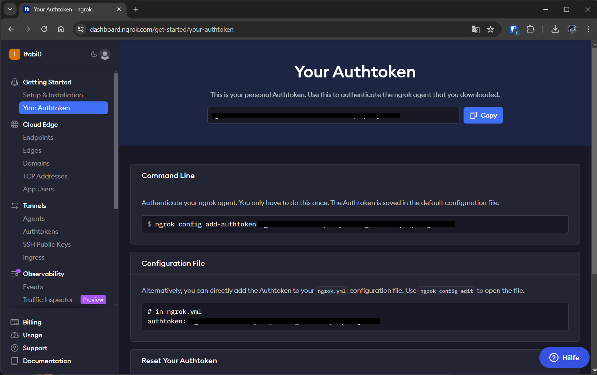

# Create ngrok tunnels

In this step we will create the ngrok tunnels and create a CName entry on our Domain.

## Authenticate ngrok client

First off we need to authenticate our ngrok client to do so, we need an authtoken from the [ngrok website](https://dashboard.ngrok.com/get-started/your-authtoken).
The web page should look similar to the example below:



In the top of the page we can copy our authtoken, in the example the authtoken is hidden, so let us
say we have there a value of `ajnbkwaoawerfavauhniluhn`. We copy the value in the field on the page,
and continue in a terminal with the following command:

``` powershell
ngrok authtoken ajnbkwaoawerfavauhniluhn
```

The resulting output should show:

``` text
Authtoken saved to configuration file: C:\Users\User\AppData\Local/ngrok/ngrok.yml
```

## Create a ngrok configuration

Now let us create a ngrok configuration that defines our tunnels.

To edit the configuration of ngrok we run

```powershell
ngrok config edit
```

Into the file that opens in our default editor we add the following lines at the end:

```yaml
tunnels:
  notifications:
    proto: http
    addr: 9442
  media:
    proto: tcp
    addr: 8445
```

We save the file and close our editor.

## Start ngrok

To start the ngrok tunnels we run:

```powershell
ngrok start notifications media
```

The resulting output should look similar to:

```text
Full request capture now available in your browser: https://ngrok.com/r/ti

Session Status                online
Account                       1fabi0 (Plan: Free)
Version                       3.9.0
Region                        Europe (eu)
Latency                       125ms
Web Interface                 http://127.0.0.1:4040
Forwarding                    https://zz99-99-9-99-999.ngrok-free.app -> http://localhost:9442
Forwarding                    tcp://4.tcp.eu.ngrok.io:65535 -> localhost:8445

Connections                   ttl     opn     rt1     rt5     p50     p90
                              0       0       0.00    0.00    0.00    0.00
```

As we need some of the output in the next steps we note down the two forwarding addresses, in the
example output these adresses are _https<span>://</span>zz99-99-9-99-999.ngrok-free.app_ and
_tcp://4.tcp.eu.ngrok.io:65535_. We also need to keep our terminal window open, as long our
terminal window is the tunnels exist.

## Configure CName Entry

In the next step we create a CName entry on our Domain, checkout how to do this on your DNS
provider. As name in the example we choose `recordingbot-local` so the fully qualified domain name
to our CName entry will be : _recoridingbot-local.example.com_. As the target domain for our CName
entry we use the tcp ngrok domain we noted down previously, in our example it is _4.tcp.eu.ngrok.io_.
So after we setup our DNS CName entry, _recordingbot-local.example.com_ points to _4.tcp.eu.ngrok.io_.

After we successfully setup our ngrok tunnels and the CName entry we can continue with [getting a
Certificate for the domain name we just created](./2-certificate.md)
