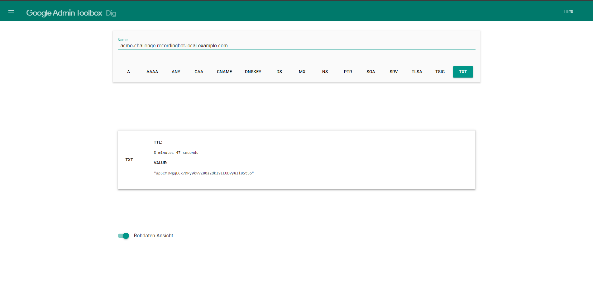

# Retrieve Certificate from Let's Encrypt

In this step we will use Certbot to retreive a certificate from Let's Encrypt with a valid trust
chain.

## Generate Certificate

In the first step, we execute the following command in a privileged environment to create the
certificate and start the signing request to Let’s Encrypt.

``` pwsh
certbot certonly --manual --preferred-challenges dns -d "recordingbot-local.example.com"
```

The output should look similar to:

``` text
Saving debug log to C:\Certbot\log\letsencrypt.log
Enter email address (used for urgent renewal and security notices)
 (Enter 'c' to cancel):
```

Certbot asks for our email address for security alerts and urgent renewal messages. We enter an
email address that we want to use for this and confirm this address by pressing Enter.

The next output we should see is:

``` text
- - - - - - - - - - - - - - - - - - - - - - - - - - - - - - - - - - - - - - - -
Please read the Terms of Service at
https://letsencrypt.org/documents/LE-SA-v1.4-April-3-2024.pdf. You must agree in
order to register with the ACME server. Do you agree?
- - - - - - - - - - - - - - - - - - - - - - - - - - - - - - - - - - - - - - - -
(Y)es/(N)o:
```

As stated in the output, we need to accept the the terms of service. Similar to before, we enter our
answer (`y`) and press Enter.

The next output we should see is:

``` text
- - - - - - - - - - - - - - - - - - - - - - - - - - - - - - - - - - - - - - - -
Would you be willing, once your first certificate is successfully issued, to
share your email address with the Electronic Frontier Foundation, a founding
partner of the Let's Encrypt project and the non-profit organization that
develops Certbot? We'd like to send you email about our work encrypting the web,
EFF news, campaigns, and ways to support digital freedom.
- - - - - - - - - - - - - - - - - - - - - - - - - - - - - - - - - - - - - - - -
(Y)es/(N)o:
```

Certbot asks us if we want to share our email address with a Let's Encrypt partner. If we want to,
we can type `y` and confirm our answer by pressing Enter. If we don't want to, we can refuse by
typing `n` and confirming our answer with Enter.

The next output we should see is:

``` text
Account registered.
Requesting a certificate for recordingbot-local.example.com

- - - - - - - - - - - - - - - - - - - - - - - - - - - - - - - - - - - - - - - -
Please deploy a DNS TXT record under the name:

_acme-challenge.recordingbot-local.example.com.

with the following value:

sp5cMJWgqECk7DPy9kvVZ80s2dkI9IEUDVy8Il8St5o

Before continuing, verify the TXT record has been deployed. Depending on the DNS
provider, this may take some time, from a few seconds to multiple minutes. You can
check if it has finished deploying with aid of online tools, such as the Google
Admin Toolbox: https://toolbox.googleapps.com/apps/dig/#TXT/_acme-challenge.recordingbot-local.example.com.
Look for one or more bolded line(s) below the line ';ANSWER'. It should show the
value(s) you've just added.

- - - - - - - - - - - - - - - - - - - - - - - - - - - - - - - - - - - - - - - -
Press Enter to Continue
```

> [!NOTE]  
> If you already used Certbot previously, it should directly show the last output.

## Set DNS TXT Entry for ACME challenge

As the output asks us todo, we need to create a TXT record on our domain for validation. Check how
to do it with your DNS provider. After we created the TXT record `_acme-challenge.recordingbot-local.example.com`
should contain the value provided by certbot `sp5cMJWgqECk7DPy9kvVZ80s2dkI9IEUDVy8Il8St5o`. To check
if that is the case we can use the Google Admin Toolbox.



If we can retreive the TXT record from the Google admin Toolbox(see screenshot above) we can
continue with retrieving the certificate.

## Retrieve Certificate

To continue retrieving the certificate with Certbot, we go back to our Certbot Terminal and press
Enter to confirm that we have completed the setup of the DNS challenge.

The resulting output should look similar to:

``` text
Successfully received certificate.
Certificate is saved at: C:\Certbot\live\recordingbot-local.example.com\fullchain.pem
Key is saved at:         C:\Certbot\live\recordingbot-local.example.com\privkey.pem
This certificate expires on 2024-10-13.
These files will be updated when the certificate renews.

NEXT STEPS:
- This certificate will not be renewed automatically. Autorenewal of --manual certificates requires the use of an authentication hook script (--manual-auth-hook) but one was not provided. To renew this certificate, repeat this same certbot command before the certificate's expiry date.

- - - - - - - - - - - - - - - - - - - - - - - - - - - - - - - - - - - - - - - -
If you like Certbot, please consider supporting our work by:
 * Donating to ISRG / Let's Encrypt:   https://letsencrypt.org/donate
 * Donating to EFF:                    https://eff.org/donate-le
- - - - - - - - - - - - - - - - - - - - - - - - - - - - - - - - - - - - - - - -
```

> [!TIP]
> The TXT DNS Record can be deleted now.

Note down the paths, where the key and the certificate is stored, as we need them in the next step.
In our example this is _C:\Certbot\live\recordingbot-local.example.com\fullchain.pem_ and
_C:\Certbot\live\recordingbot-local.example.com\privkey.pem_.

> [!NOTE]  
> The output also displays a certificate expiration date. If the certificate expires it is not
> valid anymore and debugging locally doesn't work anymore. To avoid this you can renew you're
> certificate by redoing this and the following steps.

## Convert Certificate to pfx

In windows we can only install pkcs12 certificates, so we need to convert the
certificate from certbot. To be able to do that with openssl we need a third certificate file that
was not listed by Certbot but also created. The third file can be found at the same folder as the
other two and is named cert.pem, so the full path of that file is:
_C:\Certbot\live\recordingbot-local.example.com\cert.pem_. With that located we can run:

``` pwsh
openssl pkcs12 -export
    -out C:\certificate.pfx
    -in C:\Certbot\live\recordingbot-local.example.com\cert.pem
    -inkey C:\Certbot\live\recordingbot-local.example.com\privkey.pem
    -certfile C:\Certbot\live\recordingbot-local.example.com\fullchain.pem
```

The resulting output:

``` text
Enter Export Password:
```

asks for a password we want to use for the exported certificate, to make it simple we do not enter
any password and direktly press Enter.

``` text
Verifying - Enter Export Password:
```

OpenSSL will then ask us to confirm our password. Since it is empty, we can directly press Enter again.

After that, OpenSSL should exit without any further output and we should find a new file at
_C:\certificate.pfx_ as we specified in the instruction to OpenSSL.

## Install Certficate into Windows Certificate Store

In this step we will install the certificate in the Windows certificate store. To do so we open the
file explorer at the path of our certficate file(in our case `C:/`) and double klick the
`certificate.pfx`-file. This should open the following window:


There we have to make sure that we select _Local Machine_ and then we can continue by clicking on
the _Next_ button. Windows will then ask us for administrator rights to install the certificate for
the local computer, which we accept. After that we should see the next page of the certificate
import wizard:


There the certificate import wizard asks us for the source file that we want to import. As we
opended the import wizard from the certificate directly, this should be already filled with the
Path to our certificate `C:\certificate.pfx` so we can continue by pressing the _Next_ button.


In this step of the certificate import wizard we can enter the password that protects the private-
key of our certficate and specify some import options for the certificate. Since we didn't specify
any password in openssl we do not need to enter any password, we can keep the import settings as
they are and directly click the _Next_ button.


In this step of the certificate import wizard, we are asked if we want to specify a certificate
store. We can leave the option as is and let the wizard automatically select a store based on the
certificate type and then click the _Next_ button.


Finally, the certificate import wizard will show us a summary of the settings we specified
previously. To complete the import, we click the _Finish_ button and we should see the following
message box:


## Get Certificate Thumbprint

As a final step with the certificate, we need to get the thumbprint of the certificate. The
thumbprint will later be passed to the recording application, which will use the thumbprint to load
the certificate from the certificate store. To get the thumbprint of the certificate, we run the
following command in a privileged powershell terminal:

``` pwsh
(Get-PfxCertificate -FilePath C:\certificate.pfx).Thumbprint
```

The resulting output should look similar to:

``` text
163F8FBC27610B6D45BD7CB7B3BDD3FDF78DA482
```

The output is the thumbprint of our certificate, we save this value for later.

Now we have installed a certificate with a valid certificate chain to one of the valid root
certificates and we can proceed with [creating a bot service with app registration and permissions](./3-bot-service.md).
